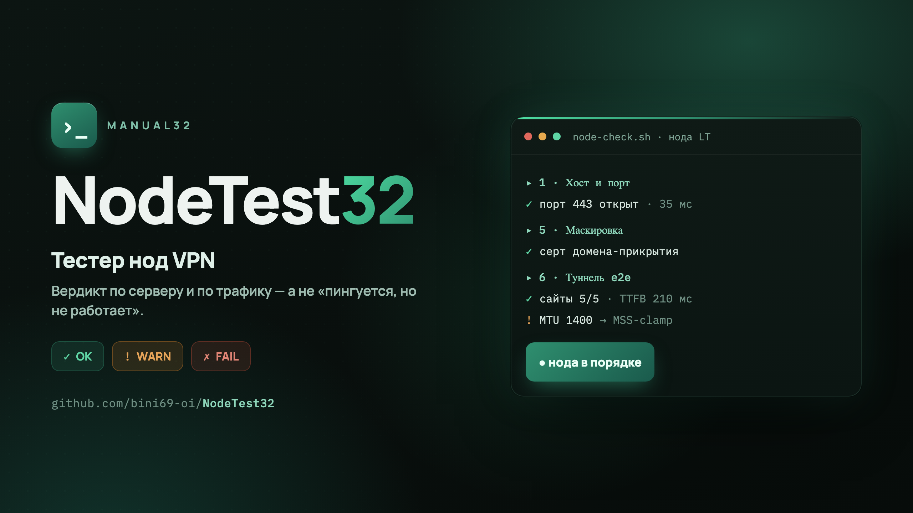

<p align="center">
  
</p>

# NodeTest32

Тестер нод VPN от [Manual32](https://manual32.online). Одно интерактивное меню: наши глубокие проверки (сквозной трафик через туннель, аудит сервера) плюс популярный набор (скорость до РФ, DPI/ТСПУ, репутация IP, регион по сервисам, железо). Даёт короткий вердикт: годен ли сервер под ноду и реально ли через него ходит трафик.

Тестер отвечает не на «пингуется ли порт», а на то, что важно на самом деле: жив ли сервер, не оверселлен ли он, держит ли канал, не засвечен ли IP и **идёт ли трафик до выхода в интернет**. Панель может рисовать ноду зелёной, а через неё ничего не работать — это ловит только сквозной тест.

## Быстрый старт

Меню одной командой (ничего ставить не надо):

```bash
bash <(curl -sL https://raw.githubusercontent.com/bini69-oi/NodeTest32/main/nodetest32.sh)
```

Поставить как команду `nodetest32` (потом запускать откуда угодно):

```bash
bash <(curl -sL https://raw.githubusercontent.com/bini69-oi/NodeTest32/main/nodetest32.sh) --install
```

Только наши тесты, без запуска чужого кода:

```bash
nodetest32 --no-external
```

Меню само определяет, где ты (на ноде или на чистом компе), и подсвечивает нужную секцию. Можно и без меню — отдельными скриптами (см. ниже).

## Что внутри

| # | Тест | Что даёт | Откуда |
|---|------|----------|--------|
| 1 | Сквозная проверка по ссылке | «пингуется, но не работает»: реальный трафик через туннель, выходной IP, TTFB, сайты | наш |
| 2 | Быстро: хост/канал/маскировка/IP | без ссылки — порт, латентность, MTU, серт, паспорт IP | наш |
| 3 | Аудит сервера | KVM/контейнер, steal, AES-NI, RAM/диск/swap, BBR, IPv6, время | наш |
| 4 | Скорость до РФ | iperf3 до российских серверов, а не «в никуда» | itdoginfo |
| 5 | ТСПУ / DPI | палится ли нода на РФ-DPI | censorcheck |
| 6 | Геоблок | что режется с этой ноды | censorcheck |
| 7 | Репутация / чистота IP | капчи, баны, стриминги: глубокая проверка блок-листов | ip.check.place |
| 8 | Регион по сервисам | какую страну видят Spotify/Netflix/CDN | ipregion |
| 9 | Железо: CPU / диск / сеть | оверселл, медленный диск | YABS |
| 10 | sysbench CPU | быстрый бенч процессора | нативно |

Плюс пункт «прогнать всё для режима» (последовательно, с пропуском по Enter).

Тестер **ничего не меняет на сервере**. На каждый провал он показывает точную команду-фикс (включить BBR, MSS-clamp от MTU-дыры, добавить swap, UseIPv4) — применяешь сам, осознанно.

## Два движка (можно и без меню)

**`node-check.sh`** — снаружи внутрь. С чистого компа или соседнего VPS, по ссылке из подписки: поднимает `xray` и гонит настоящий трафик через ноду. Хост и порт, латентность серией, маршрут, MTU-чёрная-дыра, маскировка, e2e через туннель (выходной IP, сайты, TTFB), скорость относительно твоего канала, паспорт IP.

```bash
./node-check.sh 'vless://uuid@host:443?type=tcp&security=reality&pbk=...&sni=...#my-node'
./node-check.sh 1.2.3.4 443     # без ссылки — усечённо
```

**`node-inside.sh`** — изнутри, на самой ноде по SSH. То, что снаружи не видно: виртуализация (KVM или контейнер), оверселл по steal time, AES-NI, память/диск/swap, BBR, исходящий IPv6, фаервол, время. Гоняй в первый час аренды свежего VPS, пока действует возврат.

```bash
ssh root@1.2.3.4 'bash -s' < node-inside.sh
```

## Где запускать сквозную проверку

**Не с самой ноды** — скрипт это ловит и останавливается: сервер часто не достукивается до своего же публичного IP (hairpin), а localhost завышает скорость.

**С чистой машины, без включённых VPN.** Другие туннели (на macOS это `utun0..N`) перехватывают исходящие соединения и тест врёт — покажет провал на исправной ноде. Скрипт предупредит, но лучше выключить все VPN перед запуском.

Хочешь цифры «как у клиента из России» (вместе с работой ТСПУ) — запускай с домашнего РФ-канала. Хочешь чистые цифры самой ноды — с соседнего зарубежного VPS.

## Как взять ссылку для теста

Не бери ссылку своего боевого клиента — сожжёшь ему лимит устройств (HWID). Заведи в панели отдельного тест-юзера в изолированном скваде, возьми его ссылку, прогони тест, потом удали юзера. `flow` и `path` копируй из ссылки байт-в-байт: угаданный `flow` даёт рукопожатие без трафика, а лишний или недостающий слэш в `path` у XHTTP роняет соединение в 404.

## Что значит вердикт

Каждая стадия печатает `✓` / `!` / `✗`, в конце сводная таблица и общий вывод. Код возврата: `0` всё чисто, `1` есть предупреждения, `2` есть провалы — скрипт можно вставлять в свои проверки.

`!` (WARN) — работать будет, но с оговоркой (высокий пинг, MTU меньше 1500, засвеченный IP, нет swap). `✗` (FAIL) — до боя чинить: порт закрыт, трафик не идёт, маскировка палится, OpenVZ вместо KVM. На каждый не-`OK` есть строка «куда смотреть».

## Внешние инструменты

Пункты 4–9 — это популярные чужие тесты. Мы их **не запускаем вслепую**: каждый скачивается с зафиксированной версии (конкретный коммит) и сверяется по `sha256` из [`ext/manifest`](ext/manifest) перед запуском; несовпадение — отказ. Перед стартом печатается строка источника. Флаг `--no-external` выключает их совсем — остаются только наши тесты.

Спасибо авторам:

- [vernette/ipregion](https://github.com/vernette/ipregion) — регион IP по сервисам
- [vernette/censorcheck](https://github.com/vernette/censorcheck) — DPI/ТСПУ и геоблок
- [itdoginfo/russian-iperf3-servers](https://github.com/itdoginfo/russian-iperf3-servers) — iperf3 к серверам в РФ
- [masonr/yet-another-bench-script](https://github.com/masonr/yet-another-bench-script) — YABS, бенчмарк железа
- [xykt/IPQuality](https://github.com/xykt/IPQuality) — глубокая репутация IP
- идея интерактивного меню — [saveksme/multitest](https://github.com/saveksme/multitest)

## Требования

- `curl` — обязателен (есть в macOS и почти любом Linux из коробки).
- `unzip` — чтобы сквозная проверка подтянула `xray` (`apt install unzip` / `brew install unzip`).
- `iperf3`, `sysbench`, `mtr` — по желанию; меню предложит доустановить через пакетный менеджер (`apt/dnf/yum/apk/pacman`).
- `xray-core` тянется сам под платформу с официальных релизов [XTLS/Xray-core](https://github.com/XTLS/Xray-core), кэш в `~/.nodetest32`.

Протоколы для сквозной проверки: `vless` и `trojan` (Reality / TLS / none, транспорты tcp/ws/xhttp/grpc/httpupgrade). `ss` / `vmess` / `hysteria2` туннелем пока не проверяются.

## Разбор по шагам

Подробный мануал — что каждая проверка означает, как читать `mtr`, где пороги «хорошо/плохо», что делать на каждый провал — на [manual32.online](https://manual32.online). Постоянный мониторинг боевой ноды 24/7 с алертами — раздел «Контроль» там же.

---

Manual32 · мануалы по своему VPN
